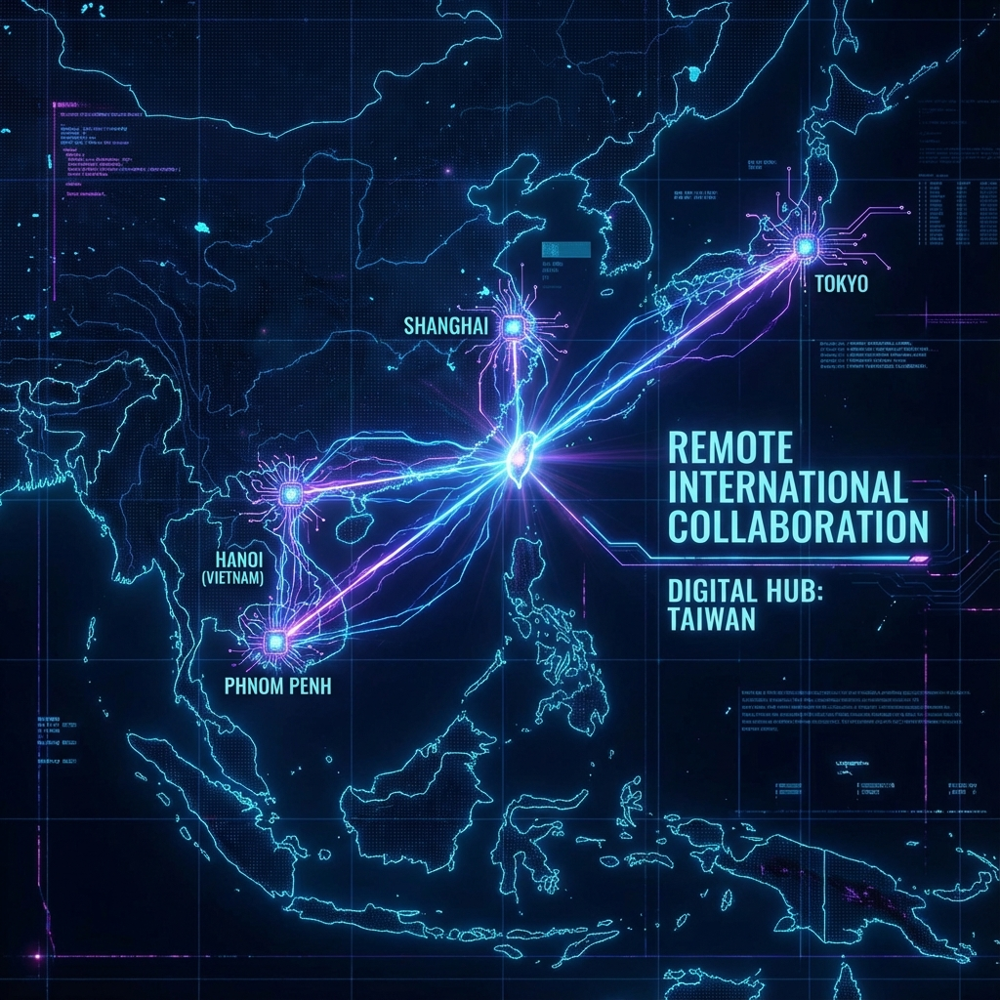

🌐 **Language / 言語**: &nbsp; [English](README.md) &nbsp;|&nbsp; [繁體中文](README.zh-TW.md) &nbsp;|&nbsp; **日本語**

  

  # こんにちは、ImL1s です 👋
  
  
  

  **シニアフルスタックエンジニア | ブロックチェーン専門家 | AI ネイティブエンジニア**
  
  🇹🇼 *台北、台湾* &nbsp;|&nbsp; 🌍 *リモートワーク対応*

---

## 🚀 私の仕事

  

> **複雑なブロックチェーンプロトコルとスムーズなモバイルユーザー体験の間の橋渡しをしています。**

**10年以上**の実務経験を持ち、**マルチチェーンブロックチェーンエコシステム**とシームレスに統合する**フルスタックモバイルアプリケーション**の開発を専門としています。

---

## 🌏 グローバルな協業

  

以下の国々のクロスファンクショナルチームとリモートで協業してきました：

🇯🇵 **日本** &nbsp;•&nbsp; 🇨🇳 **中国** &nbsp;•&nbsp; 🇻🇳 **ベトナム** &nbsp;•&nbsp; 🇰🇭 **カンボジア**

**言語**：中国語（ネイティブ）| 英語（日常会話）| 日本語（基礎会話）

---

## 🤖 AI 駆動開発

  

AI を活用してコーディングを加速し、レビューを自動化し、アーキテクチャを設計しています：

**🧠 モデル**: &nbsp; Claude &nbsp;•&nbsp; Gemini &nbsp;•&nbsp; GPT

**🛠️ ツール**: &nbsp; Claude Code &nbsp;•&nbsp; Gemini CLI &nbsp;•&nbsp; GitHub Copilot &nbsp;•&nbsp; Codex &nbsp;•&nbsp; Cursor &nbsp;•&nbsp; Windsurf

---

## 🛠️ 技術スタック

### 📱 モバイル開発

### ⛓️ ブロックチェーン

### 💻 バックエンド & ツール

---

## 🌟 注目プロジェクト

| プロジェクト | 説明 | 技術スタック |
| :--- | :--- | :--- |
| [**StickerAI Studio**](https://stickerstudio.xyz) | AI 駆動の LINE スタンプジェネレーター | `React` `Flutter` `Supabase` |
| **Light Wallet** | マルチチェーン暗号通貨ウォレット（43+ チェーン） | `Flutter` `Ethers.js` `TypeScript` |
| **Crypto AI Analysis** | Fear & Greed + AI 市場インサイト | `Next.js` `FastAPI` |
| **AutoStar** | 中古車価格分析（38 ブランド） | `Flutter` `Clean Architecture` |
| **教育アプリ** | 保険資格・タクシー免許試験対策 | `Flutter` `Firebase` `AI` |

---

  
  **一緒に素晴らしいものを作りましょう！** 🚀
  
  
  

