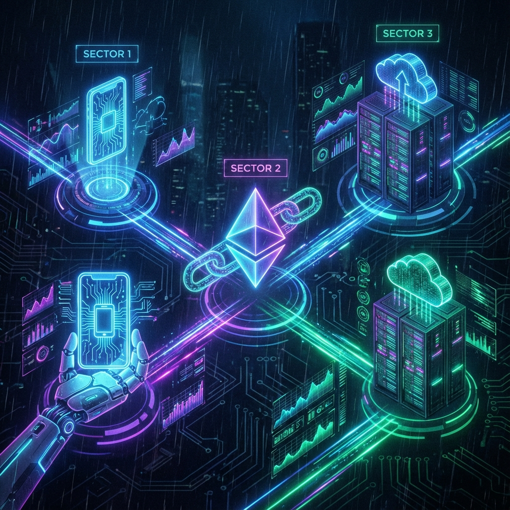

<div align="center">
  

  # Hi there, I'm ImL1s 👋
  
  [](https://iml1s.github.io)
  [](https://x.com/l1s_ai)

  **Senior Full Stack Developer | Blockchain Specialist | 10+ Years Experience**
  
  *Taipei, Taiwan* 🇹🇼 | *Remote Ready* 🌍
</div>

---

## 🚀 About Me

Experienced developer with **10+ years** in the industry, specializing in **Android, Flutter, and Blockchain** technologies. I've been active in the **Crypto/DeFi/GameFi** space since 2013.

- 📱 **Mobile Expert**: 10 years of Android experience, expert in Kotlin/Java & Flutter.
- ⛓️ **Blockchain Native**: Writing Solidity smart contracts (ERC-20/721, Mining, Staking) and building deep integrations with EVM, Bitcoin, Tron, and Solana chains.
- 🌏 **International Collaborator**: Extensive experience working with teams from **Japan 🇯🇵, China 🇨🇳, Vietnam 🇻🇳, and Cambodia 🇰🇭**.
- 🏗️ **Architecture Focused**: Strong advocate for clean architecture, MVVM/MVI, and rigorous code reviews.
- 🗣️ **Languages**: Chinese (Native), English (Conversational), Japanese (Basic).

> *"I can independently implement interactions between Android/Flutter and major blockchains (Ethereum, Bitcoin, Solana, Tron) from scratch."*

## 🛠 Tech Stack & Skills

<div align="center">
  
</div>

### 📱 Mobile Development
| Platform | Skills |
| :--- | :--- |
| **Android** | Kotlin, Java, RxJava/RxKotlin, Retrofit, OkHttp, MVVM/MVP/MVC, Jetpack Compose, Coroutines (Flow), Dagger2/Koin, Room/Realm, Bluetooth LE, Custom Views |
| **iOS** | Swift, RxSwift, MVVM, Alamofire, Moya |
| **Flutter** | Dart, BLoC, RxDart, WebSocket, Clean Architecture, Platform Channels (Embed) |

### ⛓️ Blockchain & Web3
| Area | Skills |
| :--- | :--- |
| **Solidity** | ERC-20, ERC-721, Staking Pools, Token Minting/Repay, DeFi Protocols |
| **Integration** | Web3j (Android), Web3dart (Flutter), Ethers.js (Web), Wallet Connect |
| **Chains** | Ethereum, BSC, Polygon, Solana, Tron, Bitcoin |

### 💻 Backend & Tools
| Usage | Tech |
| :--- | :--- |
| **Backend** | ASP.NET Core (Web API, DI), Node.js, Python (FastAPI) |
| **Game/AR** | Unity, Vuforia AR SDK |
| **CI/CD** | GitHub Actions, Gitlab CI, Docker |

## 🌟 Featured Projects

| Project | Description | Tech Stack |
| :--- | :--- | :--- |
| **StickerAI Studio** | Gemini AI 生成 LINE 規格貼圖 | `React` `Flutter` `Supabase` |
| **Light Wallet** | 支援 43+ 多鏈錢包與瀏覽器擴充 | `Flutter` `Ethers.js` `TypeScript` |
| **Crypto AI Analysis** | 整合 Fear & Greed 指標與 AI 解讀 | `Next.js` `FastAPI` |
| **AutoStar** | 38 品牌二手車行情、折舊分析 | `Flutter` `Clean Architecture` |
| **Edu Apps** | 保險證照題庫、計程車執業模擬考 | `Flutter` `Firebase` `AI Assistant` |

## 📊 GitHub Stats

<div align="center">
  
</div>

## 📂 Project Structure

```
index.html          # 主頁（版面、動效、內容區塊）
js/i18n.js          # 多語系字串與切換邏輯
assets/             # 圖示、OG 圖、截圖
  banner_v1.png     # Banner
  skills_matrix.png # New: Skills Visualization
  icons/
  screenshots/
```

