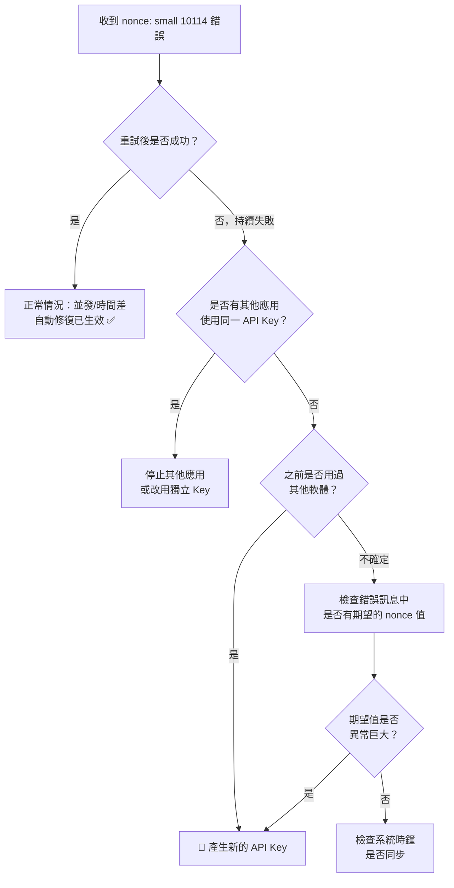

# Bitfinex API Nonce 問題指南

## 什麼是 Nonce？

Bitfinex 對每個 API Key 強制要求 **nonce 單調遞增**（monotonically increasing）。每次認證請求（REST 或 WebSocket）都必須攜帶一個比上次更大的 nonce，用來防止重放攻擊。如果發送的 nonce ≤ 伺服器記錄的最後一個 nonce，API 會回傳 **錯誤碼 10114**（`nonce: small`）。

> [!IMPORTANT]
> - Nonce 是 **per-API-key** 的。同一個 API Key 的 REST 和 WebSocket 請求共享同一個 nonce 空間。
> - Nonce 不得超過 `MAX_SAFE_INTEGER`（`9,007,199,254,740,991`），否則會因精度丟失被拒絕。

## 常見觸發原因

| 原因 | 說明 |
|------|------|
| 多個應用共用 API Key | 各自獨立生成 nonce，一方推高後另一方跟不上 |
| 快速並行請求 | 請求到達伺服器的順序不確定 |
| 容器/App 重啟 | 新程序的 nonce 可能從較早的時間戳開始 |
| 之前有軟體產生過超大 nonce | 新應用使用正常時間戳的 nonce 無法超越 |

---

## 社區常見解法（業界做法彙整）

以下彙整自 GitHub Issues、Stack Overflow、CCXT 文件、以及 Bitfinex 官方 SDK 原始碼。

### 1. 🔑 為每個應用產生獨立 API Key（Bitfinex 官方推薦）

這是 **Bitfinex 官方在文件和 GitHub Issues 中最常推薦的做法**。每個 API Key 有獨立的 nonce 追蹤，徹底避免衝突。

```
API Key A → Go 後端 (USD instance)
API Key B → Go 後端 (USDT instance)
API Key C → LendLocal App (用戶手機)
```

> Source: [Bitfinex API 文件](https://docs.bitfinex.com/docs/requirements-and-limitations)、bitfinex-api-node npm 文件

### 2. 🔄 產生新的 API Key 來「重設」Nonce

如果一個 Key 的 nonce 已被污染（被推得太高），**沒有 API 可以重設 nonce**。唯一的辦法是產生新 Key。

> Source: [CCXT GitHub #933](https://github.com/ccxt/ccxt/issues/933)、[Stack Overflow](https://stackoverflow.com/questions/47575476)

### 3. ⏱️ 使用微秒/奈秒時間戳 + 原子遞增

不同語言社區的實作方式：

#### Bitfinex 官方 Go SDK（[bitfinex-api-go](https://github.com/bitfinexcom/bitfinex-api-go)）

```go
// v2: Unix 秒 × 1,000,000 + atomic 遞增
func NewEpochNonceGenerator() *EpochNonceGenerator {
    return &EpochNonceGenerator{
        nonce: uint64(time.Now().Unix()) * 1000000,
    }
}
func (u *EpochNonceGenerator) GetNonce() string {
    return strconv.FormatUint(atomic.AddUint64(&u.nonce, 1), 10)
}

// v1: Unix 奈秒 × 1,000,000（⚠️ 容易溢位）
nonce = uint64(time.Now().UnixNano()) * 1000000
```

> [!WARNING]
> 官方 SDK 的 v1 nonce 用 `UnixNano() * 1000000`，在 2026 年約為 `1.74 × 10^24`，**遠超 `MAX_SAFE_INTEGER`（`9 × 10^15`）**。這是一個已知的設計缺陷，v2 改用了 `Unix() * 1000000`。

#### CCXT（Python/JS/PHP）

```python
# 預設: 32-bit Unix 秒
# Bitfinex 建議改用毫秒
exchange = ccxt.bitfinex({
    'nonce': lambda: int(round(time.time() * 10000))  # 自定義 nonce
})
```

> Source: [CCXT Nonce 文件](https://docs.ccxt.com/#/README?id=authentication)

#### Node.js 社區

```javascript
// 常見做法：毫秒 + 計數器
let nonceCounter = 0;
function getNonce() {
    const ms = Date.now();
    return (ms * 1000 + nonceCounter++).toString();
}
```

#### Python 社區

```python
# 常見做法：秒 × 10000
nonce = str(int(round(time.time() * 10000)))
```

### 4. 🔒 請求佇列化（Request Queue）

對於單一 API Key 的並行場景，社區常用的模式是將認證請求排隊，確保依序發送：

```javascript
// Node.js 常見模式
const queue = [];
async function authenticatedRequest(params) {
    return new Promise((resolve) => {
        queue.push({ params, resolve });
        processQueue();
    });
}
```

> Source: [Stack Overflow](https://stackoverflow.com/questions/44528938)

### 5. 🔁 遇錯重試 + Resync

這是我們的做法，也是其他 bot 常見的策略：

- 偵測 `nonce: small` 或 `10114` 錯誤
- 將 nonce 跳到當前時間重試
- 設定最大重試次數避免無限迴圈

---

## 我們的實作

### Go 後端 (`internal/client/`)

#### Nonce 生成器 — [nonce.go](file:///Users/iml1s/Documents/mine/bitfinex_lend/internal/client/nonce.go)

```go
// 使用 Unix 微秒時間戳，CAS lock-free 並發安全
func (g *MicroNonceGenerator) GetNonce() string {
    for {
        now := uint64(time.Now().UnixMicro())
        old := atomic.LoadUint64(&g.nonce)
        next := old + 1
        if now > next { next = now }  // 自動修復
        if atomic.CompareAndSwapUint64(&g.nonce, old, next) {
            return strconv.FormatUint(next, 10)
        }
    }
}
```

**vs 官方 SDK 差異：**

| | 官方 SDK | 我們的實作 |
|---|---------|-----------|
| 基底 | `Unix() × 1,000,000` | `UnixMicro()` |
| 時間修復 | ❌ 只遞增，不比較時間 | ✅ `max(now, last+1)` |
| 並發安全 | ✅ `atomic.AddUint64` | ✅ `atomic.CAS` loop |
| 長時間運行 | ⚠️ 會與實際時間偏移 | ✅ 自動修復到當前時間 |

#### REST 重試邏輯 — [bitfinex.go](file:///Users/iml1s/Documents/mine/bitfinex_lend/internal/client/bitfinex.go#L3164-L3301)

- 偵測 `nonce: small` 或 `10114` → 最多重試 **3 次**，延遲遞增 (`500ms × attempt`)
- Rate limit 重試獨立計算（最多 5 次），不消耗 nonce 重試預算

---

### LendLocal Flutter App (`lend_local/lib/core/bitfinex/`)

#### Nonce 生成器 — [nonce.dart](file:///Users/iml1s/Documents/mine/bitfinex_lend/lend_local/lib/core/bitfinex/nonce.dart)

```dart
class NonceGenerator {
  int _last = 0;

  String next() {
    final now = DateTime.now().microsecondsSinceEpoch;
    _last = now > _last ? now : _last + 1;
    return _last.toString();
  }

  void resync() {
    _last = DateTime.now().microsecondsSinceEpoch;
  }
}
```

#### REST 重試 — [rest_client.dart](file:///Users/iml1s/Documents/mine/bitfinex_lend/lend_local/lib/core/bitfinex/rest_client.dart#L309-L331)

- 兩層偵測（DioException + Bitfinex 錯誤回應）
- 偵測到 nonce 錯誤 → `resync()` → **重試 1 次**

### 方案比較

| 特性 | Go 後端 | Flutter LendLocal | 官方 SDK |
|------|---------|-------------------|----------|
| Nonce 基底 | Unix 微秒 | Unix 微秒 | Unix 秒 × 10⁶ |
| 單調遞增 | `max(now, last+1)` | `max(now, last+1)` | `last+1` only |
| 時間自動修復 | ✅ | ✅ `resync()` | ❌ |
| 並發安全 | `atomic.CAS` | 不需要 | `atomic.Add` |
| 錯誤重試 | 3 次 | 1 次 | 無 |

---

## ⚠️ 超大 Nonce API Key 問題

### 問題描述

如果一個 API Key 曾被軟體使用過**非常大的 nonce**（例如官方 SDK v1 的 `UnixNano() * 1000000`），之後所有正常微秒級 nonce 都會永遠小於伺服器記錄值。

```
伺服器記錄: 1,740,000,000,000,000,000,000,000  (v1 SDK 的 nonce)
我們生成:   1,740,100,000,000,000              (微秒) ← 差 9 個數量級
```

### 為什麼自動修復無法解決？

我們的 `max(now, last+1)` 是在**本地**比較。伺服器端的高 nonce 值對本地不可見。

### 解決方案（按社區推薦程度排序）

#### 1. ✅ 產生新的 API Key（社區共識 #1）

**所有主流解法都指向這個方案。** 這也是 Bitfinex 官方、CCXT 維護者、Stack Overflow 高票回答一致推薦的做法。

**操作步驟：**
1. 登入 [Bitfinex](https://www.bitfinex.com) → API Keys
2. 建立新 API Key（只需 **Margin Funding** 權限）
3. 更新 `.env`（後端）或 App 設定（LendLocal）
4. 刪除或停用舊 Key

#### 2. ⚠️ 覆蓋 nonce 起始值為超大數

如果無法換 Key，可以手動設定 nonce 起始值高於伺服器記錄。

```go
// Go：強制從極大值開始
ng := &MicroNonceGenerator{nonce: 99999999999999999}
```

```dart
// Dart：需暴露設定介面
final nonce = NonceGenerator();
nonce._last = 99999999999999999;
```

> [!CAUTION]
> Nonce 不得超過 `MAX_SAFE_INTEGER`（`9,007,199,254,740,991`）。如果之前的 nonce 已接近此上限，Key 將**永久失效**，只能重新產生。

#### 3. 🧪 解析錯誤回應中的期望值

某些 Bitfinex 錯誤回應可能包含期望的 nonce 值，可嘗試解析並跳躍：

```go
// 嘗試從 "nonce: small (expected: XXXX)" 格式解析
if expectedNonce := parseExpectedNonce(errorMsg); expectedNonce > 0 {
    atomic.StoreUint64(&g.nonce, expectedNonce)
}
```

> [!WARNING]
> 此格式不在 API 文件中保證，不建議作為主要依賴。

### 診斷流程



---

## Nonce 值的安全範圍

| 基底 | 2026 年的值 | MAX_SAFE_INT 剩餘空間 | 評估 |
|------|-----------|---------------------|------|
| Unix 微秒 | ~1.74 × 10¹⁵ | ~7.27 × 10¹⁵ (~80%) | ✅ 安全，可用到 ~2255 年 |
| Unix 毫秒 | ~1.74 × 10¹² | ~9.01 × 10¹⁵ (~99.98%) | ✅ 非常安全 |
| Unix 秒 × 10⁶ | ~1.74 × 10¹⁵ | ~7.27 × 10¹⁵ (~80%) | ✅ 安全（官方 SDK v2） |
| Unix 奈秒 × 10⁶ | ~1.74 × 10²⁴ | ❌ 溢位 | ❌ 官方 SDK v1 bug |
| Unix 秒 × 10⁴ | ~1.74 × 10¹³ | ~9.01 × 10¹⁵ (~99.8%) | ✅ 安全（CCXT 做法） |

---

## 相關檔案

| 檔案 | 用途 |
|------|------|
| [internal/client/nonce.go](file:///Users/iml1s/Documents/mine/bitfinex_lend/internal/client/nonce.go) | Go nonce 生成器 |
| [internal/client/nonce_test.go](file:///Users/iml1s/Documents/mine/bitfinex_lend/internal/client/nonce_test.go) | Go nonce 測試（含自動修復測試） |
| [internal/client/bitfinex.go](file:///Users/iml1s/Documents/mine/bitfinex_lend/internal/client/bitfinex.go) | Go REST 重試邏輯 |
| [lend_local/lib/core/bitfinex/nonce.dart](file:///Users/iml1s/Documents/mine/bitfinex_lend/lend_local/lib/core/bitfinex/nonce.dart) | Dart nonce 生成器 |
| [lend_local/lib/core/bitfinex/auth.dart](file:///Users/iml1s/Documents/mine/bitfinex_lend/lend_local/lib/core/bitfinex/auth.dart) | Dart 認證 + nonce 使用 |
| [lend_local/lib/core/bitfinex/rest_client.dart](file:///Users/iml1s/Documents/mine/bitfinex_lend/lend_local/lib/core/bitfinex/rest_client.dart) | Dart REST 重試邏輯 |

## 參考來源

- [Bitfinex API 文件 - Requirements and Limitations](https://docs.bitfinex.com/docs/requirements-and-limitations)
- [bitfinex-api-go 官方 SDK (nonce.go)](https://github.com/bitfinexcom/bitfinex-api-go/blob/master/pkg/utils/nonce.go)
- [CCXT Nonce 處理文件](https://docs.ccxt.com/#/README?id=authentication)
- [CCXT GitHub Issue #933 — Bitfinex nonce too small](https://github.com/ccxt/ccxt/issues/933)
- [Stack Overflow — Bitfinex nonce issues](https://stackoverflow.com/questions/44528938)
