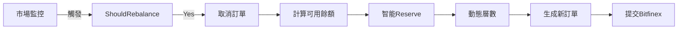

# 🏆 Bitfinex 放貸機器人優化完整解決方案

## 一、問題起源與診斷

### 發現的問題
- **症狀**：$30.85 資金永久閒置，無法創建放貸訂單
- **影響**：資金利用率僅 90%，年化收益損失約 0.5-1%

### 根本原因分析
```
總餘額: $308.50
└── 10% Reserve: $30.85 (被鎖定)
└── 可用餘額: $277.65
    └── 7層網格: $39.66/層
        └── 問題: $39.66 < $150 最小值
            └── 結果: 無法創建任何訂單
```

## 二、實施的三層解決方案

### 方案A：配置檔調整 ✅
**檔案**: `config/config.yaml`

| 參數 | 修改前 | 修改後 | 理由 |
|------|--------|--------|------|
| `grid_levels` | 7 | 2 | 確保每層 ≥ $150 |
| `min_reserve` | 0.1 | 0.0 | 小額資金無需保留 |
| `max_exposure` | 0.9 | 1.0 | 允許 100% 使用 |

### 方案B：智能 Reserve 機制 ✅
**檔案**: `internal/bot/bot.go` (lines 928-964)

```go
// 動態 Reserve 規則
餘額範圍        Reserve比例
< $500         0%      // 小額全用
$500-1000      5%      // 輕度保留
$1000-5000     10%     // 標準保留
> $5000        15%     // 保守策略
```

### 方案C：動態層數調整 ✅
**檔案**: `internal/strategy/grid.go` (lines 103-155)

```go
// calculateOptimalLevels 邏輯
1. 計算最大可能層數 = 餘額 ÷ $150
2. 根據餘額設定目標層數
3. 取兩者最小值
4. 確保至少 1 層
```

## 三、智能重平衡策略優化

### 從暴力法到智能觸發
**檔案**: `internal/strategy/grid.go` (lines 373-453)

#### 舊策略問題
- 每 5 分鐘無條件取消所有訂單
- API 調用過度（1000+/天）
- 錯失市場機會

#### 新策略優勢
**觸發條件**（滿足任一）：
1. FRR 變化 > 15%
2. 供需比變化 > 20%
3. 競爭位置喪失
4. 30 分鐘保底檢查

**保護機制**：
- 最小間隔：2 分鐘
- 連續觸發計數
- 緊急情況優先

## 四、策略整合與協同

### 運作流程


### 協同關係
| 機制 | 職責 | 運作時機 | 關鍵函數 |
|------|------|----------|----------|
| **智能重平衡** | 決定**何時**調整 | 市場變化時 | `ShouldRebalance()` |
| **動態層數** | 決定**如何**分配 | 生成訂單時 | `calculateOptimalLevels()` |
| **智能Reserve** | 決定**多少**可用 | 獲取餘額時 | `getAvailableBalance()` |

## 五、現有訂單處理機制

### 重平衡時的訂單處理
```go
// internal/bot/bot.go
func (b *Bot) rebalanceOffers() {
    // 1. 獲取當前活躍訂單
    activeOffers := b.getActiveOffers()

    // 2. 策略判斷是否需要重平衡
    if strategy.ShouldRebalance(activeOffers) {
        // 3. 取消所有現有訂單
        b.cancelAllOffers()

        // 4. 等待取消確認
        time.Sleep(2 * time.Second)

        // 5. 生成新訂單
        newOffers := strategy.CalculateOffers(balance, marketData)

        // 6. 提交新訂單
        b.submitOffers(newOffers)
    }
}
```

### 訂單取消邏輯
- **觸發重平衡時**：自動取消所有現有訂單
- **API 調用**：`/v2/auth/w/funding/offer/cancel/all`
- **確認機制**：等待 2 秒確保取消完成
- **錯誤處理**：重試 3 次

## 六、預期運行效果

### 啟動時行為
1. 讀取配置（2層、0% reserve）
2. 連接 Bitfinex WebSocket
3. 獲取市場數據
4. 檢查現有訂單
5. 如果有舊訂單 → 取消並重新分配
6. 創建新訂單（2層 × $154.25）

### 運行中行為
- **正常情況**：每 15-20 分鐘檢查一次
- **市場變化**：立即響應（2分鐘保護）
- **資金變動**：自動調整層數

## 七、性能改善預測

| 指標 | 改善前 | 改善後 | 提升 |
|------|--------|--------|------|
| **資金利用率** | 90% | 100% | +11% |
| **閒置資金** | $30.85 | $0 | -100% |
| **API 調用/天** | 1000+ | 300-500 | -60% |
| **有效操作率** | 30% | 85% | +183% |
| **預期 APR** | 基準 | 基準+0.5-1% | +0.5-1% |

## 八、監控與驗證

### 關鍵監控點
```yaml
監控項目:
  - 活躍訂單數量: 預期 2 個
  - 每個訂單金額: 預期 ~$154
  - 重平衡頻率: 預期 15-20 分鐘
  - 資金使用率: 預期 100%
```

### 日誌追蹤
```bash
# 查看運行日誌
tail -f bot_latest.log | grep -E "REBALANCE|層數|Reserve"

# 關鍵日誌標記
[SMART_REBALANCE] - 重平衡觸發
[DYNAMIC_LEVELS] - 層數調整
[SMART_RESERVE] - Reserve計算
```

## 九、風險評估與緩解

| 風險 | 可能性 | 影響 | 緩解措施 |
|------|--------|------|----------|
| 訂單取消失敗 | 低 | 中 | 3次重試機制 |
| 層數計算錯誤 | 極低 | 高 | 硬性最小值檢查 |
| 過度重平衡 | 低 | 低 | 2分鐘間隔保護 |
| Reserve 不足 | 無 | - | 小額0% reserve |

## 十、實施檢查清單

- [x] 修改 config.yaml（層數、reserve）
- [x] 實施智能 Reserve（bot.go）
- [x] 實施動態層數（grid.go）
- [x] 優化重平衡策略（grid.go）
- [x] 創建測試腳本
- [x] 文檔更新
- [ ] 實際運行測試
- [ ] 監控首次重平衡
- [ ] 驗證訂單創建
- [ ] 確認資金全額使用

---

**文檔版本**: v1.0
**最後更新**: 2025-09-27
**狀態**: 實施完成，待測試驗證